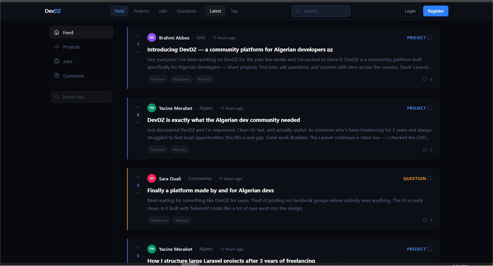
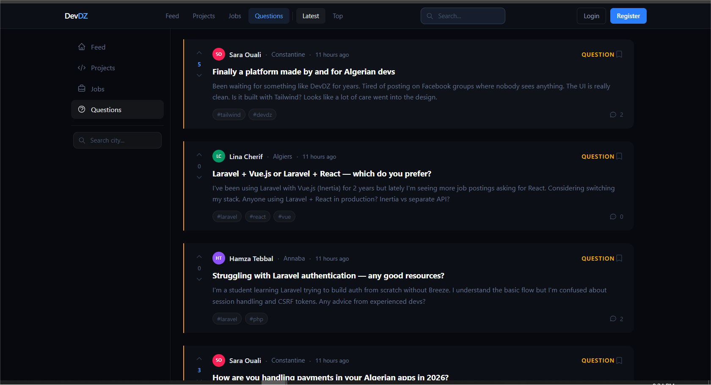
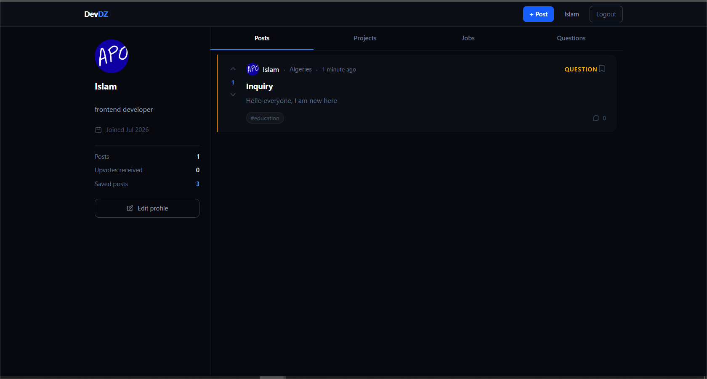
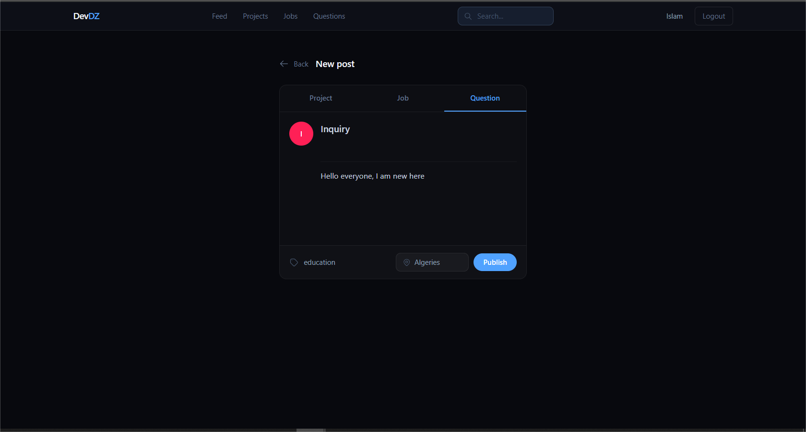
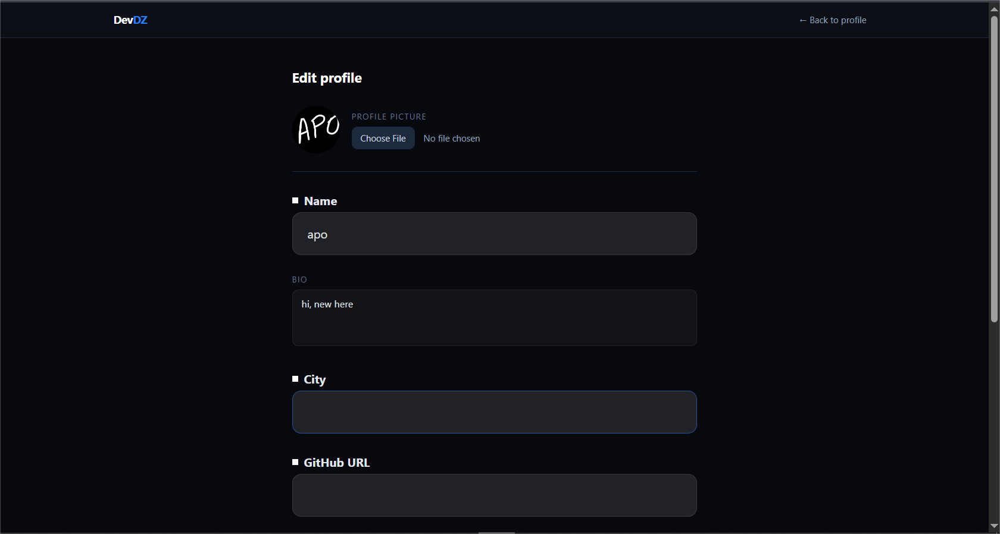
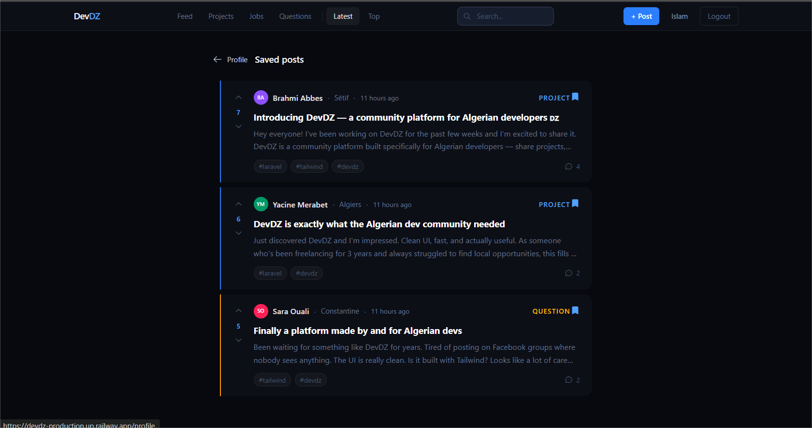

# DevDZ 🇩🇿

> A community platform built by and for Algerian developers — share projects, find jobs, ask questions, and connect with the local dev community.



---

## About

DevDZ is a full-stack web application built with Laravel and Tailwind CSS. It was created as a portfolio project to demonstrate real-world Laravel development — from custom authentication to a full voting system, comment reactions, and user profiles.

The platform is specifically designed for the Algerian developer community, filling a gap that Facebook groups and generic platforms couldn't fill.

---

## Features

### Posts
- Create posts of three types: **Project**, **Job**, or **Question**
- Tag posts with relevant technologies
- Add a city to posts for location-based filtering
- Edit and delete your own posts

### Feed
- Filter by post type (Projects, Jobs, Questions)
- Filter by city
- Filter by tag
- Full-text keyword search
- Sort by **Latest** or **Top** (by vote score)
- Infinite scroll with pagination

### Votes
- Reddit-style upvote/downvote system
- Score = upvotes − downvotes
- Toggle: clicking the same vote removes it, clicking the opposite switches it
- Guests see vote arrows but are redirected to login

### Comments
- Add comments to any post
- Delete your own comments
- Like/dislike individual comments
- Comment count shown on feed cards

### Save Posts
- Bookmark any post with a single click
- View all saved posts at `/saved`
- Save count shown on your profile

### User Profiles
- Public profile page for every user at `/users/{id}`
- Shows bio, city, GitHub link, join date
- Post count, total upvotes received, saved posts count
- Filter profile posts by type (Posts / Projects / Jobs / Questions)
- Clickable from post cards and comments

### Edit Profile
- Update name, bio, city, GitHub URL
- Upload a profile picture (avatar)
- Change password securely (requires current password)

### Authentication
- Built from scratch — no Breeze, no Jetstream
- Register, login, logout
- Custom middleware for guest/auth protection
- Form validation with inline error messages

---

## Tech Stack

| Layer | Technology |
|---|---|
| Backend | Laravel 11 |
| Frontend | Blade + Tailwind CSS v4 |
| Database | SQLite (dev) / MySQL (production) |
| Auth | Custom (no Breeze) |
| File Storage | Laravel Storage + public disk |
| Build tool | Vite |

---

## Screenshots

| Feed | Post Detail | Profile |
|---|---|---|
|  |  |  |

| Create Post | Edit Profile | Saved Posts |
|---|---|---|
|  |  |  |

---

## Getting Started

### Requirements
- PHP 8.2+
- Composer
- Node.js 18+
- npm

### Installation

```bash
# Clone the repository
git clone https://github.com/your-username/devdz.git
cd devdz

# Install PHP dependencies
composer install

# Install Node dependencies
npm install

# Copy environment file
cp .env.example .env

# Generate application key
php artisan key:generate

# Run migrations and seed realistic data
php artisan migrate --seed

# Create storage symlink for avatar uploads
php artisan storage:link

# Build assets
npm run build

# Start the development server
php artisan serve
```

Then visit `http://127.0.0.1:8000`

### Seeded Accounts

After running `--seed`, the following accounts are available:

| Name | Email | Password | City |
|---|---|---|---|
| Brahmi Abbes | abbes@devdz.dz | password | Sétif |
| Yacine Merabet | yacine@devdz.dz | password | Algiers |
| Amine Khelil | amine@devdz.dz | password | Oran |
| Sara Ouali | sara@devdz.dz | password | Constantine |
| Riad Benali | riad@devdz.dz | password | Algiers |
| Hamza Tebbal | hamza@devdz.dz | password | Annaba |
| Lina Cherif | lina@devdz.dz | password | Algiers |
| Karim Saadi | karim@devdz.dz | password | Oran |

---

## Project Structure

```
app/
├── Http/
│   ├── Controllers/
│   │   ├── Auth/
│   │   │   ├── RegisterController.php
│   │   │   ├── LoginController.php (SessionController)
│   │   │   └── LogoutController.php
│   │   ├── HomeController.php
│   │   ├── PostController.php
│   │   ├── UserController.php
│   │   ├── VoteController.php
│   │   ├── CommentController.php
│   │   ├── CommentReactionController.php
│   │   └── SavedPostController.php
│   └── Middleware/
├── Models/
│   ├── User.php
│   ├── Post.php
│   ├── Tag.php
│   ├── Comment.php
│   ├── Vote.php
│   ├── CommentReaction.php
│   └── SavedPost.php (pivot)

resources/views/
├── components/
│   ├── layout.blade.php
│   ├── post-card.blade.php
│   ├── post-meta.blade.php
│   ├── tag-list.blade.php
│   ├── user-avatar.blade.php
│   ├── vote-buttons.blade.php
│   ├── save-button.blade.php
│   ├── back-link.blade.php
│   ├── comment-card.blade.php
│   ├── comment-form.blade.php
│   └── forms/
│       ├── composer.blade.php
│       ├── auth-card.blade.php
│       └── auth-field.blade.php
├── auth/
│   ├── login.blade.php
│   └── register.blade.php
├── posts/
│   ├── index.blade.php
│   ├── create.blade.php
│   ├── edit.blade.php
│   └── saved.blade.php
└── users/
    ├── profile.blade.php
    └── edit.blade.php

database/
├── migrations/
│   ├── create_users_table.php
│   ├── create_posts_table.php
│   ├── create_tags_table.php
│   ├── create_post_tag_table.php
│   ├── create_comments_table.php
│   ├── create_votes_table.php
│   ├── create_comment_reactions_table.php
│   └── create_saved_posts_table.php
└── seeders/
    └── DatabaseSeeder.php
```

---

## Database Schema

```
users
  id, name, email, password, bio, city, github_url, avatar, timestamps

posts
  id, user_id, title, body, type (project|job|question), city, timestamps

tags
  id, name (unique), timestamps

post_tag (pivot)
  post_id, tag_id

comments
  id, post_id, user_id, body, timestamps

votes
  id, user_id, post_id, type (up|down), unique(user_id, post_id), timestamps

comment_reactions
  id, user_id, comment_id, type (like|dislike), unique(user_id, comment_id), timestamps

saved_posts (pivot)
  id, user_id, post_id, unique(user_id, post_id), timestamps
```

---

## Key Design Decisions

### Custom Auth over Breeze
Built authentication from scratch to demonstrate understanding of Laravel's session handling, password hashing, CSRF protection, and middleware — rather than relying on a package that abstracts all of it.

### Component Architecture
The UI is built with a strict componentization philosophy:
- Components are only created when used in **multiple places**
- Single-use complex markup is kept inline
- No over-engineering: `x-post-meta`, `x-vote-buttons`, `x-user-avatar` are used across 3+ views each

### Vote System Design
Votes use a dedicated `votes` table with a `unique(user_id, post_id)` constraint (requires an `id` primary key for Eloquent `save()` to work correctly). Toggle logic: same vote = undo, opposite vote = switch.

### No Right Sidebar
The right sidebar was removed in favor of a wider, cleaner feed. Hardcoded city activity and tag data provides no real value — removed rather than faking it.

---

## Roadmap

- [ ] Real-time vote/comment updates (Laravel Reverb)
- [ ] Notifications system
- [ ] Keyword search with ranking
- [ ] Company profiles for job posters
- [ ] Chargily payment integration for featured posts
- [ ] Mobile-responsive layout
- [ ] Dark/light mode toggle
- [ ] Admin moderation panel

---

## Deployment

The app is deployed on [Railway](https://railway.app) / [Render](https://render.com).

**Live demo:** [devdz.up.railway.app](https://devdz.up.railway.app) *(coming soon)*

To deploy yourself:

```bash
# Set environment variables on your platform:
APP_ENV=production
APP_KEY=your-key
DB_CONNECTION=mysql
DB_HOST=your-db-host
DB_DATABASE=devdz
DB_USERNAME=your-username
DB_PASSWORD=your-password

# Run on deploy:
php artisan migrate --force
php artisan storage:link
php artisan config:cache
php artisan route:cache
php artisan view:cache
```

---

## Contributing

This is a portfolio project but contributions and feedback are welcome.

1. Fork the repository
2. Create a feature branch (`git checkout -b feature/your-feature`)
3. Commit your changes (`git commit -m 'Add your feature'`)
4. Push to the branch (`git push origin feature/your-feature`)
5. Open a Pull Request

---

## License

MIT License — see [LICENSE](LICENSE) for details.

---

## Author

**Brahmi Abbes**
- GitHub: [@abbes](https://github.com/abbes)
- DevDZ: [devdz.dz](https://devdz.dz)
- Built at ENSTA Algiers, 2026